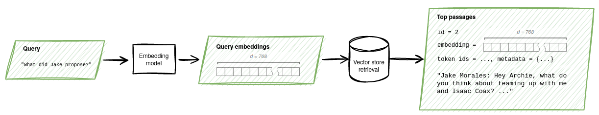

## GoodAI-LTM
Long-term memory (LTM) is  increasingly recognized as an essential component in applications powered by large language models 
(LLMs). 

Among the benefits of LTM is the possibility of continual learning. This is the ability to accumulate knowledge over time,
possibly over the agent's entire lifetime. As their knowledge builds incrementally, agents can leverage learned skills
to acquire increasingly complex abilities. Continual learning helps make agents robust against distributional drift, more capable 
of continuous adaptation, and more human-like.

GoodAI-LTM brings together all the components necessary for equipping agents with text-based long term memory. 
This includes text embedding models, reranking, vector databases, chunking, metadata such as time stamps and 
document information, memory and query rewriting (expansion and disambiguation), storage and retrieval. 

The package is especially adapted to provide a dialog-centric memory stream for social agents.

* **Embedding models**: Use OpenAI, Hugging Face Sentence Transformers, or our own locally trainable embeddings. 
The trainable embeddings allow multiple embeddings for a query or passage, which can capture different aspects of the text for more accurate retrieval.

* **Query-passage match ranking**: In addition to similarity-based retrieval, we support models for estimating 
query-passage matching after retrieval. 

* **Vector databases**: We currently provide a light-weight local vector database as well as support for FAISS.

The present emphasis on dialog is also a limitation: The memory is not currently optimized for other uses, such as 
retrieving source code. See the Future plans section for features that are on our todo list.

## Installation

    pip install goodai-ltm

## Short example

The following code snippet creates an instance of LTM, loads in some text and then retrieves the most relevant text chunks given a query:

    from goodai.ltm.mem.auto import AutoTextMemory
    mem = AutoTextMemory.create()
    mem.add_text("Lorem ipsum dolor sit amet, consectetur adipiscing elit\n")
    mem.add_text("Duis aute irure dolor in reprehenderit in voluptate velit esse cillum dolore\n",
                 metadata={'timestamp': time.time(), 'type': 'generic'})
    r_memories = mem.retrieve(query='dolorem eum fugiat quo voluptas nulla pariatur?', k=3)

## Loading a text memory instance

A default memory instance can be created as follows:

    from goodai.ltm.mem.auto import AutoTextMemory

    mem = AutoTextMemory.create()

You can also configure the memory by passing parameters to the `create` method.
In the following example, the memory uses a "gpt2" tokenizer
for chunking, a T5 model for embeddings, a 
FAISS index for embedding storage instead of a simple vector
database, and a custom chunking configuration.

    import torch
    from transformers import AutoTokenizer
    from goodai.ltm.embeddings.auto import AutoTextEmbeddingModel
    from goodai.ltm.mem.auto import AutoTextMemory
    from goodai.ltm.mem.config import TextMemoryConfig
    from goodai.ltm.mem.mem_foundation import VectorDbType
    
    embedding_model = AutoTextEmbeddingModel.from_pretrained('st:sentence-transformers/sentence-t5-base')
    tokenizer = AutoTokenizer.from_pretrained('gpt2')
    config = TextMemoryConfig()
    config.chunk_capacity = 30  # tokens
    config.queue_capacity = 10000  # chunks
    mem = AutoTextMemory.create(emb_model=embedding_model,
                                matching_model=None, 
                                tokenizer=tokenizer,
                                vector_db_type=VectorDbType.FAISS_FLAT_L2, 
                                config=config,
                                device=torch.device('cuda:0'))

## Text memory usage

Call the `add_text` method to add text to the memory.
Text may consist of phrases, sentences or documents.

    mem.add_text("Lorem ipsum dolor sit amet, consectetur adipiscing elit\n")

Internally, the memory will chunk and index the text
automatically.

Text can be associated with an arbitrary metadata dictionary, such as:

    mem.add_text("Duis aute irure dolor in reprehenderit in voluptate velit esse cillum dolore\n",
                 metadata={'timestamp': time.time(), 'type': 'generic'})

Internally, the memory concatenates text stored using add_text with any text previously sent to the memory.

To retrieve a list of passages associated with a query,
call the `retrieve` method:

    r_memories = mem.retrieve(query='dolorem eum fugiat quo voluptas nulla pariatur?', k=3)

The `retrieve` method returns a list of objects of type `RetrievedMemory`, containing
the following properties:

* `passage`: The text of the memory. This corresponds to text found in a matching chunk, but it may be expanded using text from adjacent chunks.
* `distance`: Calculated distance between the query and the chunk passage.
* `confidence`: If a query-passage matching model is available, this is the probability assigned by the model.
* `metadata`: Metadata associated with the retrieved text, if any.

## How it works

For a slightly more detailed view of how the memory works, let us revisit the storage and retrieval of text passages.

### Storage

    text_example = """\
    Jake Morales: Hey Archie, what do you think about teaming up with me and Isaac Coax? 
    We could come up with a plan that would distract Lucas Fern.
    Archie: That would be great. Thanks for helping me out."""

To store this text, we create an instance of the default memory class and add the text to it.

    mem = AutoTextMemory.create()
    mem.add_text(text_example)
   
Optionally, text can be rewritten to form memories that are less ambiguous and more self contained. To do this, we 
need to provide a rewrite language model when creating the memory. We then pass both the text to be stored and some 
preceding text for context to the `add_text` method. 
    
    r = OpenAIRewriteModel()
    mem = AutoTextMemory.create(query_rewrite_model=r, memory_rewrite_model=r)

    passage = "Archie: That would be great."
    context = """Jake Morales: Hey Archie, what do you think about teaming up with me and Isaac Coax? 
        We could come up with a plan that would distract Lucas Fern."""
    mem.add_text(text=passage, rewrite=True, rewrite_context=context)
    
This will rewrite the passage "Archie: That would be great." as "Archie thinks it would be great to team up with Jake Morales and Isaac Coax to come up 
with a plan that would distract Lucas Fern." and store the rewritten text.
    
The text is encoded by the tokenizer as token ids.

    [39568, 17989, 35, 11468, 25261, 6, 99, 109, 47, 206, 59, 165, 154, 62, 19, 162, 8, 
     12370, 944, 3631, 116, 166, 115, 283, 62, 19, 10, 563, 14, 74, 21943, 7895, 21572, 4, 50118, 8138, 
     17309, 35, 280, 74, 28, 372, 4, 4557, 13, 1903, 162, 66, 4]

The tokenized text is split into overlapping chunks that are recorded in a chunk queue.

| Id | Metadata | Content |
| ----- | -------- | ------- |
| 0 | {'foo': 'bar'} | "    Jake Morales: Hey Archie, what do you think about teaming up with me and Isaac Coax?" |
| 1 | {'foo': 'bar'} | " think about teaming up with me and Isaac Coax? \n    We could come up with a plan" |
| 2 | {'foo': 'bar'} | " \n    We could come up with a plan that would distract Lucas Fern.\n    Archie:" |
| 3 | {'foo': 'bar'} | " that would distract Lucas Fern.\n    Archie: That would be great. Thanks for helping me out." |
| 4 | {'foo': 'bar'} | " That would be great. Thanks for helping me out." |

The embedding model converts each chunk into a high-dimensional vector, e.g., a unit vector of dimension 768. 
The embeddings, and the corresponding chunk indexes, are added to the vector database.

The passages are now represented in memory as pairs of vectors and chunk indexes in the vector database and as 
sequences of tokens in the chunk queue. From the token sequences, the text can be recovered.

### Retrieval 

To retrieve memories, we pass a query and the desired number of memories to the method `retrieve`. For example,

    mem.retrieve("What does Jake propose?", k=2)

will return the two passages most relevant to the query.

Queries, like memories, can optionally be rewritten. In this case, we still pass a single text to `retrieve`;
the text is interpreted as a query preceded by context. For example,

    mem.retrieve("John: Not everyone is fond of ice cream. Mary: Do you like it?", k=3, rewrite=True)
    
will rewrite the query as "Does John like ice cream?". 

The embedding model converts the query into an embedding. Then the stored embeddings closest to the query embedding 
are found and the corresponding texts decoded.

Optionally, a query-passage matching model can be used to compute pairwise query-passage matching probabilities 
and rerank the passages.

## Embedding models

### Loading

An embedding model is loaded as follows:

    from goodai.ltm.embeddings.auto import AutoTextEmbeddingModel

    em = AutoTextEmbeddingModel.from_pretrained(model_name)

The `model_name` can be one of the following:

* A SentenceTransformer (Huggingface), starting with `"st:"`, for example, `"st:sentence-transformers/multi-qa-mpnet-base-cos-v1"`.
* An OpenAI embedding model name, starting with `"openai:"`, for example, `"openai:text-embedding-ada-002"`.
* One of our fine-tuned models:

Name | Base model                                       | # parameters | # storage emb
---- |--------------------------------------------------|--------------| -----
em-MiniLM-p1-01 | multi-qa-MiniLM-L6-cos-v1 | 22.7m        | 1  
em-MiniLM-p3-01 | multi-qa-MiniLM-L6-cos-v1 | 22.7m        | 3  
em-distilroberta-p1-01 | sentence-transformers/all-distrilroberta-v1 | 82.1m        | 1
em-distilroberta-p3-01 | sentence-transformers/all-distrilroberta-v1 | 82.1m        | 3
em-distilroberta-p5-01 | sentence-transformers/all-distrilroberta-v1 | 82.1m        | 5

### Usage of embedding models

To get embeddings for a list of queries, call 
the `encode_queries` method, as follows:

    r_emb = em.encode_queries(['hello?'])

This returns a numpy array. To get a Pytorch tensor,
add the `convert_to_tensor` parameter:

    r_emb = em.encode_queries(['hello?'], convert_to_tensor=True)

To get embeddings for a list of passages, call 
the `encode_corpus` method, as follows:

    s_emb = em.encode_corpus(['it was...', 'the best of...'])

A peculiarity of our embedding model is that queries
and passages can have more than one embedding.
Embedding tensors have 3 axes: The batch size, the number of
embeddings, and the number of embedding dimensions. Typically,
the number of embeddings per query/passage will be 1, except for the 
passage embeddings in some of our fine-tuned models.

### Evaluations of embedding models

We're interested in retrieval of relatively short 
passages (one to a few sentences) using conversational
queries that may be found in a chat. To this end we've developed
an evaluation based on datasets [QReCC](https://github.com/apple/ml-qrecc),
[StrategyQA](https://allenai.org/data/strategyqa), and
[MS MARCO](https://microsoft.github.io/msmarco/). (Fine-tuning is
done with different datasets.)
Results in the following table show top-3 and top-10
retrieval accuracy for each dataset.

Model | qrecc @3 | qrecc @10 | strategyqa @3 | strategyqa @10 | msmarco @3 | msmarco @10
----- |-------| -------- |-----------|------------| --------- | ----------
openai:text-embedding-ada-002 | 67.09 | 76.80 | 68.00     | 82.40      | 73.10 | 80.14 | 
st:sentence-transformers/multi-qa-MiniLM-L6-cos-v1 | 69.98 | 77.57 | 73.90     | 87.75      | 70.31 | 77.71 |
st:sentence-transformers/all-distilroberta-v1 | 65.01 | 76.15 | 66.35     | 82.50      | 68.59 | 78.34 |
st:sentence-transformers/sentence-t5-large | 68.40 | 78.28 | 72.55     | 86.60      | 71.30 | 80.51 |
st:sentence-transformers/all-mpnet-base-v2 | 70.69 | 80.19 | 74.50     | 87.65      | 75.00 | 81.77 |
st:sentence-transformers/multi-qa-mpnet-base-cos-v1 | 74.95 | 82.42 | 79.75     | 91.25      | 75.00 | 82.85 |
em-MiniLM-p1-01 (ours) | 72.43 | 79.26 | 75.50 | 89.00 | 71.75 | 79.60 |
em-MiniLM-p3-01 (ours) | 72.87 | 80.02 | 78.00     | 89.75      | 73.38 | 79.96 |
em-distilroberta-p1-01 (ours) | 77.67 | 83.84 | 83.25     | 94.15      | **79.78** | 84.39 |
em-distilroberta-p3-01 (ours) | 78.33 | **84.66** | 86.55     | 95.40      | 79.51 | **85.29** |
em-distilroberta-p5-01 (ours) | **78.88** | 84.44 | **87.40** | **95.70**  | 79.24 | 84.84 |

Model `em-distilroberta-p1-01` is the default embedding model used
by this library. While `em-distilroberta-p3-01` and `em-distilroberta-p5-01` have better
retrieval accuracy, note that they require storing 3 and 5 embeddings
per chunk, respectively. 

## Query-passage matching models

### Loading

A query-passage matching/reranking model can be loaded as follows:

    from goodai.ltm.reranking.auto import AutoTextMatchingModel
    
    model = AutoTextMatchingModel.from_pretrained(model_name)

The `model_name` can be one of the following:

* A "st:" prefix followed by the name of a Huggingface cross-encoder compatible with the SentenceTransformers library, like "st:cross-encoder/stsb-distilroberta-base"
* An "em:" prefix followed by the name of an embedding model supported by this library, like "em:openai:text-embedding-ada-002" or "em:em-distilroberta-p3-01"

Memory instances, by default, do not use a query-passage matching model. To enable one, it should be configured
as follows:

    from goodai.ltm.embeddings.auto import AutoTextEmbeddingModel
    from goodai.ltm.mem.auto import AutoTextMemory
    from goodai.ltm.mem.config import TextMemoryConfig
    from goodai.ltm.reranking.auto import AutoTextMatchingModel
    
    
    # Low-resource embedding model
    emb_model = AutoTextEmbeddingModel.from_pretrained('em-MiniLM-p1-01')
    # QPM model that boosts retrieval accuracy
    qpm_model = AutoTextMatchingModel.from_pretrained('em:em-distilroberta-p5-01')
    config = TextMemoryConfig()
    config.reranking_k_factor = 8
    mem = AutoTextMemory.create(matching_model=qpm_model, emb_model=emb_model, config=config)

The `reranking_k_factor` setting tells the memory how many candidates it should consider
for reranking. The user requests `k` memories. The reranking algorithm considers
`k * reranking_k_factor` chunks.

### Usage of query-passage matching models

The `predict` method of the model takes a list of
query-passage tuples and returns a list of floats
representing estimated match probabilities. Example:

    model = AutoTextMatchingModel.from_pretrained('em:em-distilroberta-p5-01')
    sentences = [
        ('Mike: What is your favorite color?', 'Steve: My favorite color is purple.'),
        ('Name the inner planets.', 'It was the best of times, it was the worst of times.'),
    ]
    prob = model.predict(sentences)
    print(prob)

### Boosting the accuracy of low-resource embedding models

At this time, we haven't found a reranking cross-encoder that can consistently boost
the retrieval accuracy of our best embedding models. That said, you can use accurate
embedding models as query-passage matching models, alongside a low-resource embedding
model. *This combination's accuracy nearly matches that of the best embedding models from 
this library.*

The following tests were performed by configuring a memory to use `em-MiniLM-p1-01`
as the embedding model and `em:em-distilroberta-p5-01` as the matching/reranking model
with different values of the `reranking_k_factor` setting.

reranking_k_factor | qrecc @3 | qrecc @10 | strategyqa @3 | strategyqa @10 | msmarco @3 | msmarco @10
----- |----------|-----------|---------------|----------------|------------| ----------
1 | 76.97    | 79.75     | 84.65         | 89.05          | 76.62      | 79.33 |
2 | 77.95    | 81.39     | 86.55         | 92.85          | 77.89      | 81.41 |
3 | 78.33    | 82.53     | 87.10         | 93.90          | 78.61      | 82.85 |
5 | 78.60    | 83.19     | 87.35         | 94.60          | 78.97      | 83.48 |
8  | 78.93    | 84.44     | 87.25         | 95.15          | 79.33      | 83.84 |
10 | 78.93    | 84.50     | 87.45         | 95.55          | 79.15      | 84.21 |

Model `em-MiniLM-p1-01` stores a single embedding of size 384 per chunk, while model
`em-distilroberta-p5-01` produces 5 storage embeddings per chunk, of size 768. The number of storage embeddings
has little impact when the embedding model is used as a query-passage matching model.
It does matter, however, in terms of chunk storage capacity when embeddings
are attached to chunks. In the case of the two models in question, the difference 
in footprint is 10-fold.

Using a matching model does come with a performance overhead in every query, but in 
the context of an LLM-based chat agent implementation, the overhead should be unnoticeable.

## More examples

Additional example code can be found in the `examples` folder. 

`examples/dump_mem.py` adds text to memory and shows how it is stored.

`examples/wiki_retrieval.py` stores and queries articles from Wikipedia.

`examples/rewriting.py` demonstrates query and memory rewriting.

Each example can be run from the command line, for example:

    cd goodai-ltm
    python examples/rewriting.py
    
## Use in GoodAI's AI game

An early application of GoodAI-LTM is in GoodAI's forthcoming [AI Game](https://www.goodai.com/ai-in-games/). 
LLMs are used to shape NPC behavior and to generate dialog. Long-term memory is used to provide characters 
with backstories and allows them to accumulate  experience during game play. 

Internally, we integrate the library with its C# port which allows us to split the library functionality between
server and client more easily. The C# part of the library has not been made public yet.

## Future plans

We will continue to improve GoodAI-LTM. Possible next steps include
* Retrieval weighted by recency and importance
* Flag for preventing internal text concatenation in mem.add_text()
* Embeddings for source code retrieval
* Storage and retrieval methods without embeddings
* Improvements to the currently experimental query and memory rewriting feature and its default prompts
* Configurable chunk overlapping and expansion
* Iterating on improvements to our datasets and models
