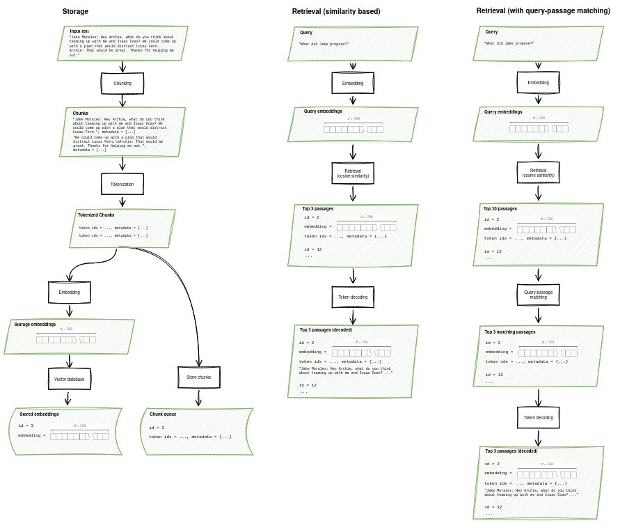
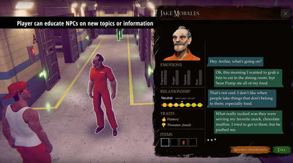

## GoodAI-LTM
Long-term memory (LTM) is  increasingly recognized as an essential component in applications powered by large language models 
(LLMs). 

Among the benefits of LTM is the possibility of continual learning. This is the ability to accumulate knowledge over time,
possibly over the agent's entire lifetime. As their knowledge builds incrementally, agents can leverage learned skills
to acquire increasingly complex abilities. Continual learning helps make agents robust against distributional drift, more capable 
of continuous adaptation, and more human-like.

GoodAI-LTM brings together all the components necessary for equipping agents with text-based long term memory. 
This includes text embedding models, reranking, vector databases, chunking, metadata such as time stamps and 
document information, memory and query rewriting (expansion and disambiguation), storage and retrieval. 

The package is especially adapted to provide a dialog-centric memory stream for social agents.

* **Embedding models**: Use OpenAI, Hugging Face Sentence Transformers, or our own locally trainable embeddings. 
The trainable embeddings allow multiple embeddings for a query or passage, which can capture different aspects of the text for more accurate retrieval.

* **Query-passage match ranking**: In addition to similarity-based retrieval, we support models for estimating 
query-passage matching after retrieval. 

* **Vector databases**: We currently provide a light-weight local vector database as well as support for FAISS.

The present emphasis on dialog is also a limitation: The memory is not currently optimized for other uses, such as 
retrieving source code.

## Installation

    pip install goodai-ltm

## Loading a text memory instance

A default memory instance can be created as follows:

    from goodai.ltm.mem.auto import AutoTextMemory

    mem = AutoTextMemory.create()

You can also configure the memory by passing parameters to the `create` method.
In the following example, the memory uses a "gpt2" tokenizer
for chunking, a T5 model for embeddings, a 
FAISS index for embedding storage instead of a simple vector
database, and a custom chunking configuration.

    import torch
    from transformers import AutoTokenizer
    from goodai.ltm.embeddings.auto import AutoTextEmbeddingModel
    from goodai.ltm.mem.auto import AutoTextMemory
    from goodai.ltm.mem.config import TextMemoryConfig
    from goodai.ltm.mem.mem_foundation import VectorDbType
    
    tok = AutoTokenizer.from_pretrained('gpt2')
    config = TextMemoryConfig()
    config.chunk_capacity = 30  # tokens
    config.queue_capacity = 10000  # chunks
    em = AutoTextEmbeddingModel.from_pretrained('st:sentence-transformers/sentence-t5-base')
    mem = AutoTextMemory.create(emb_model=em,
                                matching_model=None, tokenizer=tok,
                                vector_db_type=VectorDbType.FAISS_FLAT_L2, config=config,
                                device=torch.device('cuda:0'))

## Text memory usage

Call the `add_text` method to add text to the memory.
Text may consist of phrases, sentences or documents.

    mem.add_text("Lorem ipsum dolor sit amet, consectetur adipiscing elit\n")

Internally, the memory will chunk and index the text
automatically.

Text can be associated with an arbitrary metadata object, such as:

    mem.add_text("Duis aute irure dolor in reprehenderit in voluptate velit esse cillum dolore\n",
                 metadata={'timestamp': '2023-04-19', 'type': 'generic'})

To retrieve a list of passages associated with a query,
call the `retrieve` method:

    r_memories = mem.retrieve(query='dolorem eum fugiat quo voluptas nulla pariatur?', k=3)

The `retrieve` method returns a list of objects of type `RetrievedMemory`, containing
the following properties:

* `passage`: The text of the memory. This corresponds to text found in a matching chunk, but it may be expanded using text from adjacent chunks.
* `distance`: A distance metric between the query and the chunk passage.
* `confidence`: If a query-passage matching model is available, this is the probability assigned by the model.
* `metadata`: Metadata associated with the retrieved text, if any.

## Detailed example

For a slightly more detailed view of how the memory works, let us revisit the storage and retrieval of text passages.

    text_example = """\
    Jake Morales: Hey Archie, what do you think about teaming up with me and Isaac Coax? 
    We could come up with a plan that would distract Lucas Fern.
    Archie: That would be great. Thanks for helping me out."""

To store this text, we create an instance of the default memory class and add the text to it.

    mem = AutoTextMemory.create()
    mem.add_text(text_example)
    
The text is encoded by the tokenizer as token ids.

    [39568, 17989, 35, 11468, 25261, 6, 99, 109, 47, 206, 59, 165, 154, 62, 19, 162, 8, 
     12370, 944, 3631, 116, 166, 115, 283, 62, 19, 10, 563, 14, 74, 21943, 7895, 21572, 4, 50118, 8138, 
     17309, 35, 280, 74, 28, 372, 4, 4557, 13, 1903, 162, 66, 4]

The tokenized text is split into overlapping chunks that are recorded in a chunk queue. The chunk queue holds the complete token 
sequence and for each chunk, the indexes of the starting and ending token. 

	0 = {Chunk} <goodai.ltm.mem.chunk.Chunk object at 0x7fb2716e5a00>
	 capacity = {int} 24
	 from_token_seq_id = {int} 0
	 index = {int} 0
	 indexed = {bool} False
	 metadata = {NoneType} None
	 to_token_seq_id = {int} 24
	1 = {Chunk} <goodai.ltm.mem.chunk.Chunk object at 0x7fb2704194c0>
	 capacity = {int} 24
	 from_token_seq_id = {int} 12
	 index = {int} 1
	 indexed = {bool} False
	 metadata = {NoneType} None
	 to_token_seq_id = {int} 36
	 
	 ...

The embedding model converts each chunk into a high-dimensional vector, e.g., a unit vector of dimension 768. 
The embeddings, and the corresponding chunk indexes, are added to the vector database.

The passages are now represented in memory as pairs of vectors and chunk indexes in the vector database and as 
sequences of tokens in the chunk queue. From the token sequences, the text can be recovered.

During retrieval, the stored embeddings closest to the query embedding are found and the corresponding texts 
decoded.

In addition to the steps above, it is also possible to rewrite queries and memories and to perform passage 
reranking after retrieval. 

The diagrams below illustrate what happens during storage and retrieval (sans optional query and memory rewriting).

## Loading an embedding model

An embedding model is loaded as follows:

    from goodai.ltm.embeddings.auto import AutoTextEmbeddingModel

    em = AutoTextEmbeddingModel.from_pretrained(model_name)

The `model_name` can be one of the following:

* A SentenceTransformer (Huggingface), starting with "st:", for example, "st:sentence-transformers/multi-qa-mpnet-base-cos-v1".
* An OpenAI embedding model name, starting with "openai:", for example, "openai:text-embedding-ada-002".
* One of our fine-tuned models:

Name | Base model                                       | Params
---- |--------------------------------------------------| ---
example1 | sentence-transformers/multi-qa-mpnet-base-cos-v1 | 80m
example2 | sentence-transformers/all-distrilroberta-v1      | 120m

## Embedding model usage

To get embeddings for a list of queries, call 
the `encode_queries` method, as follows:

    r_emb = em.encode_queries(['hello?'])

This returns a numpy array. To get a Pytorch tensor,
add the `convert_to_tensor` parameter:

    r_emb = em.encode_queries(['hello?'], convert_to_tensor=True)

To get embeddings for a list of passages, call 
the `encode_corpus` method, as follows:

    s_emb = em.encode_corpus(['it was...', 'the best of...'])

A peculiarity of our embedding model is that queries
and passages can have more than one embedding.
Embedding tensors have 3 axes: The batch size, the number of
embeddings, and the number embedding dimensions. Typically,
the number of embeddings per query/passage will be 1, except for the 
passage embeddings in some of our fine-tuned models.

## Loading a query-passage matching model

A query-passage matching/reranking model can be loaded as follows:

    model = AutoTextMatchingModel.from_pretrained(model_name)

The `model_name` can be one of the following:

* A "st:" prefix followed by the name of a Huggingface cross-encoder compatible with the SentenceTransformers library, like "st:cross-encoder/stsb-distilroberta-base"
* 

## Query-passage matching model usage

The `predict` method of the model takes a list of
query-passage tuples and returns a list of floats
representing match probabilities. Example:

    model = AutoTextMatchingModel.from_pretrained('st:cross-encoder/stsb-distilroberta-base')
    sentences = [
        ('Mike: What is your favorite color?', 'Steve: My favorite color is purple.'),
        ('Name the inner planets.', 'It was the best of times, it was the worst of times.'),
    ]
    prob = model.predict(sentences)
    print(prob)

## Use in GoodAI's AI game

An early application of GoodAI-LTM is in GoodAI's forthcoming AI game. LLMs are used to shape NPC behavior and to 
generate dialog. Long-term memory is used to provide characters with backstories and allows them to accumulate 
experience during game play. 

## Evaluation of embedding models

We're interested in retrieval of relatively short 
passages (one to a few sentences) using conversational
queries that may be found in a chat. To this end we've developed
an evaluation based on datasets [QReCC](https://github.com/apple/ml-qrecc),
[StrategyQA](https://allenai.org/data/strategyqa), and
[MS MARCO](https://microsoft.github.io/msmarco/). 
Results in the following table show top-1, top-3 and top-10
retrieval accuracy for each dataset.

Model | qrecc@1 | qrecc@3 | qrecc@10 | strategyqa@1 | strategyqa@3 | strategyqa@10 | msmarco@1 | msmarco@3 | msmarco@10
----- | ------- | ------- | -------- | ------------ | ------------ | ------------- | --------- | --------- | ----------
st/multi-qa-mpnet-base-cos-v1 | 56.66 | 74.95 | 82.42 | 57.70 | 79.75 | 91.25 | 64.71 | 75.00 | 82.85 | 

## Evaluation of query-passage matching models

We also evaluated a memory with a fixed embedding model (st:sentence-transformers/multi-qa-mpnet-base-cos-v1)
and different query-passage matching/reranking models.

Model | qrecc@3 | qrecc@10 | strategyqa@3 | strategyqa@10 | msmarco@3 | msmarco@10
----- | ------- | -------- | ------------ | ------------- | --------- | ----------
st/stsb-distilroberta-base | 67.41 | 78.28 | 69.45 | 87.85 | 54.69 | 69.86 |

## Future plans

We will continue to improve GoodAI-LTM. Possible next steps include
* Retrieval weighted by recency and importance
* Embeddings for source code retrieval
* Storage and retrieval methods without embeddings
* Improvements to the currently experimental query and memory rewriting feature and its default prompts
* Iterating on improvements to our datasets and models
